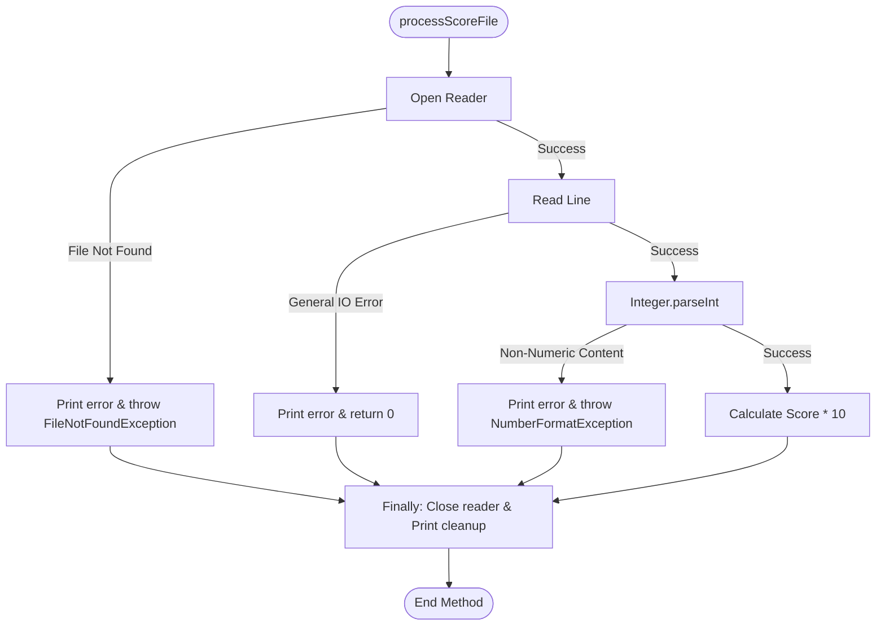

# Score Processor

This project implements a **Score Processor** in Java. It showcases robust exception handling patterns using `try-catch-finally` blocks, resource cleanup, exception re-throwing, and JUnit 5 unit testing with temporary directories (`@TempDir`).

## Table of Contents
- [Project Structure](#project-structure)
- [How Exception Handling Works](#how-exception-handling-works)
- [Validation & Exception Flow](#validation--exception-flow)
- [JUnit 5 Test Coverage](#junit-5-test-coverage)
- [Compilation and Execution](#compilation-and-execution)

---

## Project Structure

The project code is organized inside the `src/` folder:

* **[ScoreProcessor.java](file:///c:/Users/rajpr/adv-prg-asnmts/adv-prg-assignments/assignment18/scoreProcessor/src/ScoreProcessor.java)**: Core utility that reads a file, parses a numeric score, multiplies it by 10, and handles various I/O and format exceptions.
* **[ScoreProcessorTest.java](file:///c:/Users/rajpr/adv-prg-asnmts/adv-prg-assignments/assignment18/scoreProcessor/src/ScoreProcessorTest.java)**: Unit tests that verify proper scoring calculations and exception raising under erroneous environments.
* **[Main.java](file:///c:/Users/rajpr/adv-prg-asnmts/adv-prg-assignments/assignment18/scoreProcessor/src/Main.java)**: The executable entry point demonstrating a basic execution flow reading a `score.txt` file.

---

## How Exception Handling Works

The core of this assignment is in [ScoreProcessor.java](file:///c:/Users/rajpr/adv-prg-asnmts/adv-prg-assignments/assignment18/scoreProcessor/src/ScoreProcessor.java), which implements a detailed `try-catch-finally` structure:

1. **`try` block**:
   - Opens a `FileReader` inside a `BufferedReader` to read the first line of the file.
   - Parses the line as an integer with `Integer.parseInt(line.trim())`.
   - Multiplies the score by 10 and returns the result.

2. **`catch` blocks**:
   - **`FileNotFoundException`**: Catches when the specified file does not exist, prints an error log, and **re-throws** the exception using `throw e` so the calling program knows compilation/execution cannot proceed.
   - **`NumberFormatException`**: Catches when the text in the file cannot be parsed as an integer (e.g., `"ABC"`), prints an error log, and **re-throws** the exception using `throw e`.
   - **`IOException`**: Catches general file-reading issues, prints an error log, and returns a default score of `0`.

3. **`finally` block**:
   - Ensures the file resource (`BufferedReader`) is closed if it was successfully opened (`reader != null`).
   - Handles any potential `IOException` that might arise during `reader.close()`.
   - Prints `"File cleanup completed"` **always**, ensuring resource release even if parsing or finding the file fails.

---

## Validation & Exception Flow



---

## JUnit 5 Test Coverage

The test class [ScoreProcessorTest.java](file:///c:/Users/rajpr/adv-prg-asnmts/adv-prg-assignments/assignment18/scoreProcessor/src/ScoreProcessorTest.java) uses `@TempDir` to generate isolated, temporary directories on disk for testing. This avoids cluttering the system disk during test runs.

* **`testValidScoreCalculation`**: Creates a temporary file, writes `"8"` to it, processes the file, and asserts the result is `80`.
* **`testMissingFile`**: Asserts that trying to read `missingFile.txt` successfully throws `FileNotFoundException`.
* **`testInvalidNumberFormat`**: Writes `"ABC"` to a temporary file and asserts that trying to process it throws `NumberFormatException`.

---

## Compilation and Execution

### Compilation
Compile the source code files by running:
```bash
javac src/*.java
```

### Running Tests
To run the JUnit 5 tests, execute:
```bash
java -cp ".;lib/*" org.junit.platform.console.ConsoleLauncher --select-class ScoreProcessorTest
```
*(Ensure JUnit 5 jars are in the classpath/project setup).*
