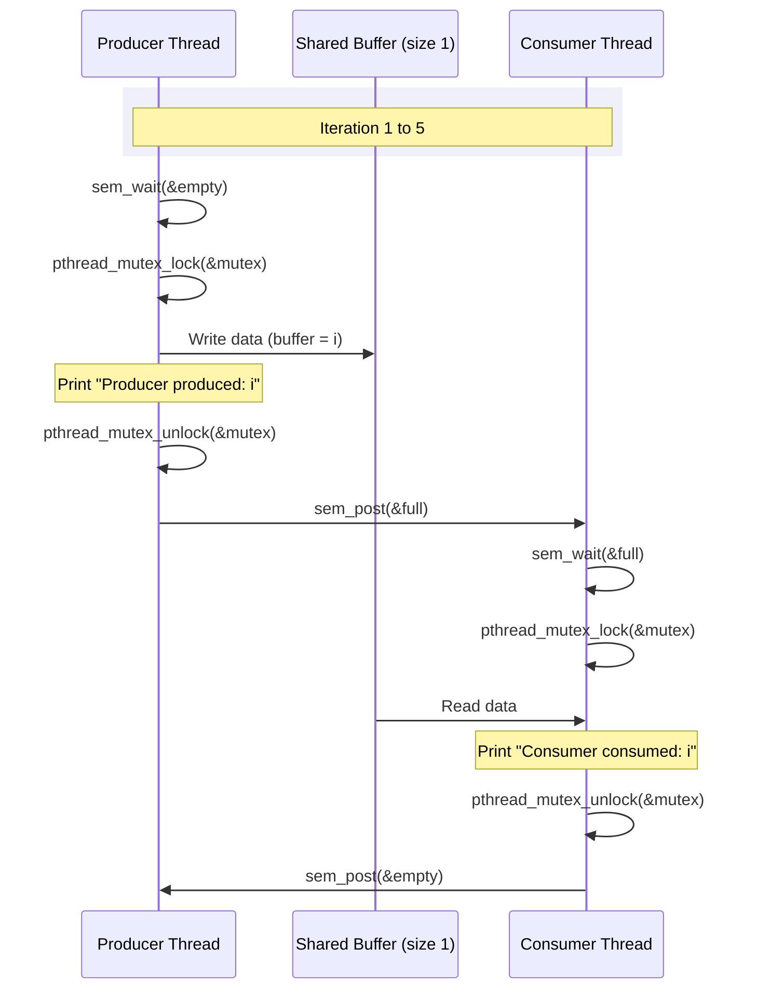

# Assignment 16: Producer-Consumer Problem using POSIX Semaphores and Mutex

This directory contains a C implementation of the classic **Producer-Consumer Problem** using POSIX Threads (`pthread`), POSIX Semaphores (`sem_t`), and Mutexes (`pthread_mutex_t`).

## Problem Description

The producer-consumer problem (also known as the bounded-buffer problem) is a classic multi-process/multi-thread synchronization problem. 
- A **Producer** thread generates data and places it into a shared buffer.
- A **Consumer** thread retrieves and processes that data from the shared buffer.

The key challenge is to ensure that:
1. The producer does not write into a full buffer.
2. The consumer does not read from an empty buffer.
3. Only one thread accesses the buffer at a time (Mutual Exclusion).

---

## Code Overview

The implementation is located in [posix.c](file:///c:/Users/rajpr/adv-prg-asnmts/adv-prg-assignments/assignment16/posix.c).

### Synchronization Mechanisms Used

- **`sem_t empty`**: A semaphore initialized to `1` representing the number of empty slots in the buffer. The producer waits on this semaphore before producing, and the consumer signals it after consuming.
- **`sem_t full`**: A semaphore initialized to `0` representing the number of filled slots in the buffer. The consumer waits on this semaphore before consuming, and the producer signals it after producing.
- **`pthread_mutex_t mutex`**: A mutex used to protect the critical section (reading/writing the shared buffer) ensuring mutual exclusion.

### Code Workflow



1. **Initialization**:
   - `empty` semaphore initialized to `1` (buffer capacity is 1).
   - `full` semaphore initialized to `0`.
   - `mutex` initialized for mutual exclusion.
2. **Execution**:
   - Two threads are created: one for the `producer` and one for the `consumer`.
   - The producer produces 5 items (values 1 to 5), and the consumer consumes them.
   - The thread execution is synchronized so that production and consumption alternate.
3. **Cleanup**:
   - Semaphores and mutexes are destroyed using `sem_destroy` and `pthread_mutex_destroy`.

---

## Compilation and Execution

### Prerequisites

Ensure you have a C compiler (like `gcc`) and the POSIX Threads library installed on your system.

### Compilation

Open a terminal in this directory and run the following command:

```bash
gcc posix.c -pthread -o posix
```

*(Note: The `-pthread` flag is required to link the POSIX threads library.)*

### Running the Program

Run the compiled executable:

```bash
./posix
```

### Expected Output

Since the buffer size is `1` and the semaphores enforce alternating access, the output will show the producer and consumer acting in a synchronized manner:

```text
Producer produced: 1
Consumer consumed: 1
Producer produced: 2
Consumer consumed: 2
Producer produced: 3
Consumer consumed: 3
Producer produced: 4
Consumer consumed: 4
Producer produced: 5
Consumer consumed: 5
```
