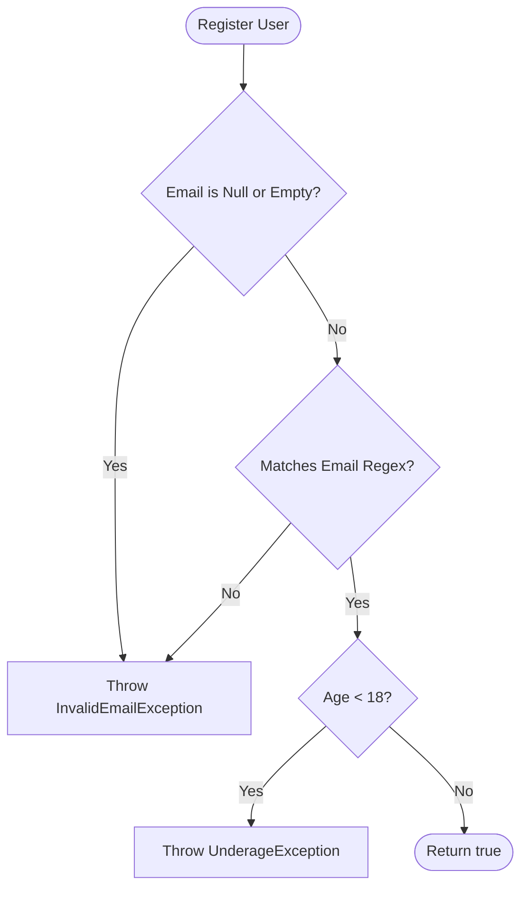

# Assignment 17: User Onboarding and Registration Service

This directory contains a Java implementation of a **User Onboarding and Registration Service** that demonstrates validation logic, custom checked/unchecked exceptions, and JUnit 5 unit testing.

## Overview

The onboarding service validates two key inputs for registering a user:
1. **Email**: Must not be null or empty, and must match a standard email format.
2. **Age**: Must be at least 18 years old.

If validations fail, custom exceptions are thrown. If all validations pass, the user registration is successful.

---

## Code Structure

The source files are located in the [src](file:///c:/Users/rajpr/adv-prg-asnmts/adv-prg-assignments/assignment17/userOnboarding/src/) directory:

- **[RegistrationService.java](file:///c:/Users/rajpr/adv-prg-asnmts/adv-prg-assignments/assignment17/userOnboarding/src/RegistrationService.java)**: Core service containing the registration and validation logic.
- **[InvalidEmailException.java](file:///c:/Users/rajpr/adv-prg-asnmts/adv-prg-assignments/assignment17/userOnboarding/src/InvalidEmailException.java)**: A **checked exception** (extends `Exception`) thrown when an email is null, empty, or format-wise invalid.
- **[UnderageException.java](file:///c:/Users/rajpr/adv-prg-asnmts/adv-prg-assignments/assignment17/userOnboarding/src/UnderageException.java)**: An **unchecked/runtime exception** (extends `RuntimeException`) thrown when the registering user is under 18.
- **[RegistrationServiceTest.java](file:///c:/Users/rajpr/adv-prg-asnmts/adv-prg-assignments/assignment17/userOnboarding/src/RegistrationServiceTest.java)**: JUnit 5 test suite verifying positive and negative validation test cases.
- **[Main.java](file:///c:/Users/rajpr/adv-prg-asnmts/adv-prg-assignments/assignment17/userOnboarding/src/Main.java)**: A simple driver class containing a basic multi-threading task demonstration.

---

## Validation Details



### 1. Email Format Pattern
Email addresses are validated against the following regular expression:
```regex
^[A-Za-z0-9+_.-]+@[A-Za-z0-9.-]+\.[A-Za-z]{2,10}$
```

### 2. Exception Hierarchy
- **`InvalidEmailException` (Checked)**: Because it represents an input error that a user/caller should anticipate and recover from, it is implemented as a checked exception.
- **`UnderageException` (Unchecked)**: Because it represents a business policy violation where the calling thread might choose not to catch it explicitly, it is implemented as a runtime exception.

---

## Unit Tests

The JUnit test suite in `RegistrationServiceTest.java` verifies:
- `testSuccessfulRegistration`: Standard registration with valid inputs returns `true`.
- `testNullEmailThrowsException`: `null` email throws `InvalidEmailException`.
- `testEmptyEmailThrowsException`: Empty/whitespace-only email throws `InvalidEmailException`.
- `testInvalidEmailFormatThrowsException`: Incorrect email patterns throw `InvalidEmailException`.
- `testUnderageUserThrowsException`: Age < 18 throws `UnderageException`.
- `testAgeExactly18IsAccepted`: Age of 18 is successfully accepted.

---

## Compilation and Running Tests

### Compilation
To compile the source code, open your terminal in the `userOnboarding` directory and compile the Java source files:
```bash
javac src/*.java
```

### Running Tests
To run the JUnit 5 tests, ensure you have the JUnit library included in your classpath:
```bash
java -cp ".;lib/*" org.junit.platform.console.ConsoleLauncher --select-class RegistrationServiceTest
```
*(Replace `lib/*` with the path containing the JUnit 5 jars on your system).*
